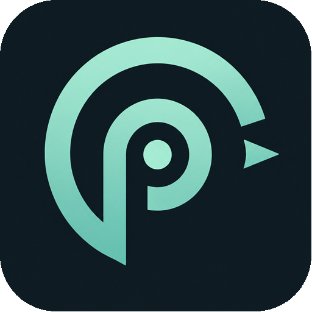
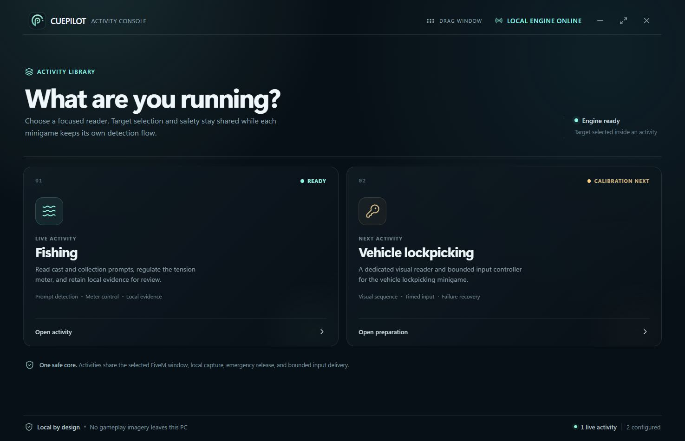

<p align="center">
  
</p>

<h1 align="center">CuePilot</h1>

<p align="center">Local minigame assistance, precisely timed.</p>

CuePilot is a Svelte/Tauri desktop app backed by a local, headless .NET engine. Its activity library opens focused minigame readers that share one validated game target and safety core; the frontend never captures the game or sends input itself.



## Install on Windows

1. Open the [latest CuePilot release](https://github.com/Blazzer10200/CuePilot/releases/latest).
2. Download `CuePilotDesktop-win-Setup.exe` and run it. The Velopack installer is per-user, so it does not require administrator access.
3. Launch **CuePilot** from the Start menu, open an activity, and select the running FiveM window once.
4. Use `F10` for Fishing and `Pause / Break` for an immediate emergency stop. `F9` remains reserved but cannot start automatic lockpicking while Class C calibration stays gated. Both activity shortcuts can be changed in Settings.

CuePilot supports Windows 10/11 x64 and bundles its self-contained .NET engine. Velopack checks for WebView2 during installation, so users do not need Node.js, Rust, the .NET SDK, or repository files. A matching SHA-256 checksum and release manifest are attached to every GitHub release. Because this community build is not code-signed, Windows SmartScreen may require **More info → Run anyway** on first installation.

Installed copies check the public GitHub release feed on launch and every six hours. When an update is available, the version badge and update notice open a review screen with release notes and progress. Installation is always user-confirmed, is disabled while an activity is running, stops the owned engine sidecar, and relaunches CuePilot after the verified package is applied. A manual installer remains available on the release page if the in-app path cannot reach GitHub.

Version 5.2.0 is the one-time migration from the legacy NSIS layout. Its Velopack pack ID is `CuePilotDesktop`, deliberately separate from `%LOCALAPPDATA%\CuePilot`, because that legacy directory also contains settings and diagnostics. Close the legacy app, install 5.2.0 manually, and launch from the refreshed **CuePilot** shortcut; later releases update in-app. Do not remove the old NSIS entry until any wanted `%LOCALAPPDATA%\CuePilot` data is backed up.

## Activities

- **Fishing — Ready:** the current deterministic prompt and tension-meter controller.
- **Vehicle Lockpicking — live calibration:** input-free observation while concurrent Class C target-label evidence is validated. All automated lockpicking input remains gated.

The app opens on the activity library. Returning there stops any running activity and releases held input before changing workspaces. See [Activity architecture](docs/activities.md) for the module boundary and Lockpicking evidence checklist.

## Fishing profile

1. Select **Select FiveM target**, then use **Verify setup**. It performs a read-only target, capture, and input-backend check; it never sends a key or mouse event.
2. Leave input delivery on **Automatic — wait for FiveM**. CuePilot waits up to ten seconds for you to return to the game and never takes foreground focus from FiveM or its NUI.
3. Open **Settings** to choose a global Start / Stop shortcut (default `F10`). From FiveM, press it once to start and again to stop.
4. Preflight resolves FiveM, waits for it to become foreground without activating it, verifies capture, and checks input.
5. The loop verifies the Cast prompt before pressing `E`, detects and controls the circular meter, verifies Keep Fish before collecting, then waits for the next verified Cast prompt.

Every LMB hold is independently capped at 35–90 ms by the feedback controller. LMB is never sent outside the active circle minigame.

## Dashboard

- Target, capture, and input health are visible together.
- Current automation state, detector confidence, and processed samples are shown live.
- Controller settings and local detection evidence are available in focused secondary panels.
- The Fishing Start / Stop shortcut is configurable from `F6` through `F12` and works while FiveM remains focused.
- The reserved Lockpicking shortcut defaults to `F9` and is independently configurable from `F6` through `F12`; it cannot enable Class C input until the evidence gate passes.
- `Pause / Break` is the global emergency stop and releases held input.
- Fishing stops if FiveM stops being the active visible window.

## Input modes

- **Automatic · Wait for FiveM** — waits up to ten seconds for you to return to FiveM without stealing focus, then uses physical scan codes. Recommended.
- **Foreground only** — refuses input unless FiveM is already foreground.

## Diagnostics

Numeric fishing traces are stored under:

```text
%LOCALAPPDATA%\CuePilot\diagnostics\
```

They contain detector measurements, high-level loop transitions, input state, and bounded annotated lock/loss screenshots with paired evidence metadata. Detection Review formats the trace as a compact local activity timeline; nothing is uploaded.

Useful engine probes:

```powershell
dotnet test .\tests\CuePilot.Tests\CuePilot.Tests.csproj -c Release
dotnet run --project .\CuePilot.csproj -c Release -- --self-test
dotnet run --project .\CuePilot.csproj -c Release -- --target-probe FiveM_b3258_GTAProcess
dotnet run --project .\CuePilot.csproj -c Release -- --capture-probe FiveM_b3258_GTAProcess
dotnet run --project .\CuePilot.csproj -c Release -- --input-probe FiveM_b3258_GTAProcess
dotnet run --project .\CuePilot.csproj -c Release -- --replay-fishing .\tests\CuePilot.Tests\Fixtures\Fishing
```

## Development

From the repository root, install dependencies with `npm --prefix ui install` and run the desktop app with `npm --prefix ui run tauri:dev`. The complete local gate is:

```powershell
pwsh -NoProfile -File .\scripts\verify.ps1 -All
```

See the [development guide](docs/development.md) for focused checks, architecture boundaries, the inspection bridge, fixture hygiene, and the release gate.

## Project structure

- `src/Application` — headless engine startup, persistence, and the versioned stdin/stdout bridge.
- `src/Automation` — fishing and lockpicking detectors, temporal trackers, class profiles, controllers, and state machines.
- `src/Capture` — visible-desktop frame capture.
- `src/Input` — foreground-only physical input delivery and safety checks.
- `src/Platform` — Windows target resolution and interop.
- `ui/src` — Svelte desktop interface and engine client.
- `ui/src/lib/activities` — activity picker and minigame-specific workspaces.
- `ui/src-tauri` — Tauri window, sidecar lifecycle, global shortcut, diagnostics access, and Velopack update service.
- `scripts/package-velopack.ps1` — allowlisted release staging, Velopack packaging, checksums, and release manifest generation.
- `tests/CuePilot.Tests` — fishing, lockpicking, migration, input, capture, and bridge contracts.
- `docs` — activity architecture, development workflow, and operator-facing project references.

For task-oriented entry points and search recipes, use the [code map](docs/code-map.md).

## Safety

- Run CuePilot and FiveM at the same Windows integrity level.
- No anti-cheat bypass, injection, stealth, or detection-evasion behavior is included.
- The emergency stop releases any LMB or `E` input CuePilot currently owns; an idle stop injects nothing.
- The bridge is local newline JSON over redirected stdin/stdout; it opens no network listener. The only normal network client is the user-facing release updater, which reads CuePilot's public GitHub release assets.

## License

[MIT](LICENSE)
