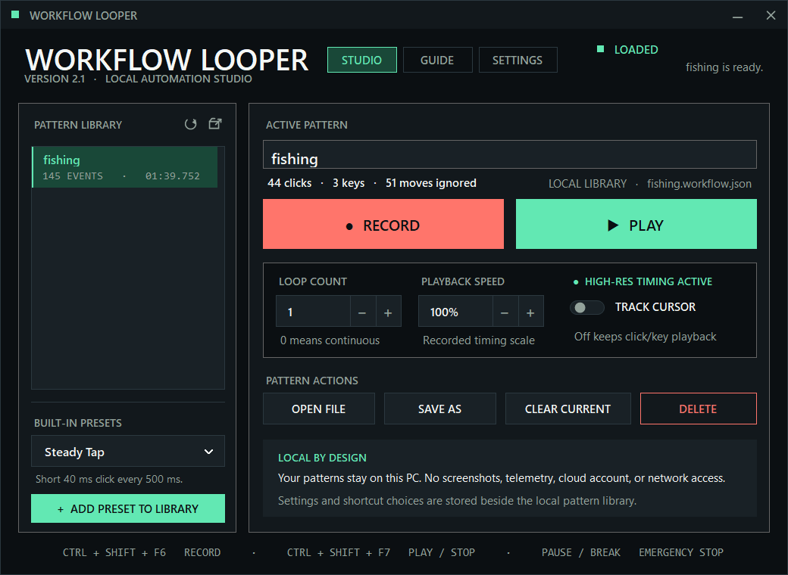
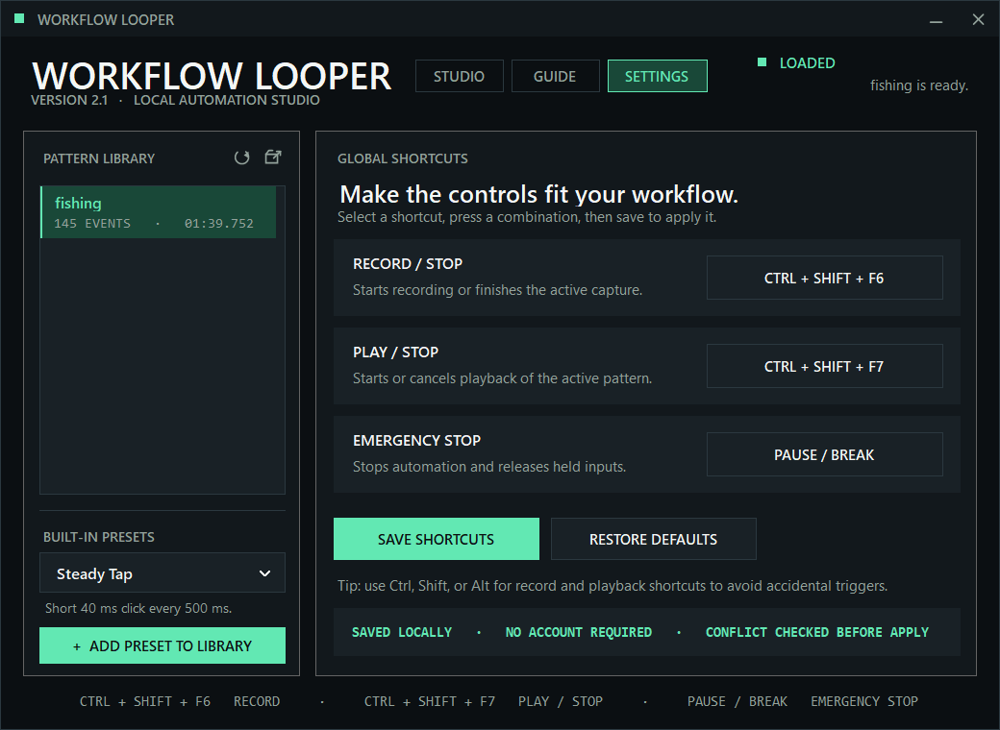
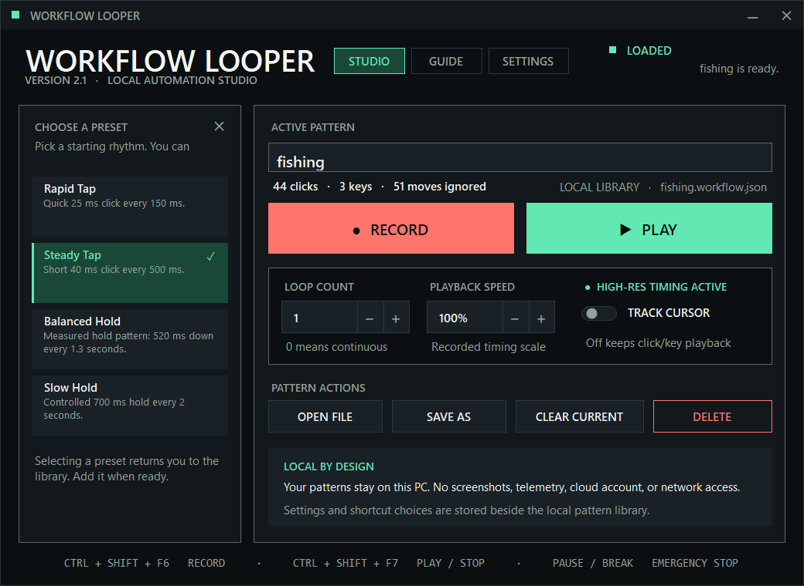

# Workflow Looper

[](https://github.com/Blazzer10200/WorkflowLooper/actions/workflows/build.yml)
[](https://github.com/Blazzer10200/WorkflowLooper/releases/latest)

Workflow Looper is a focused Windows macro recorder for repeatable keyboard and mouse workflows. Record once, save the result as a local pattern, then replay it with adjustable loop count and speed.



## Highlights

- Records global keyboard input, mouse buttons, wheel events, and optional cursor movement.
- Replays the exact recorded timing with a Windows high-resolution waitable timer.
- Keeps cursor tracking off by default for accurate click/key-only workflows.
- Stores reusable patterns in a searchable local library.
- Includes clear-current, confirmed delete, Save As, and four built-in click presets.
- Provides configurable global record, playback, and emergency-stop hotkeys.
- Uses a fully themed animated Studio/Guide/Settings interface with reduced-motion support.
- Replaces native title-bar, spinner, dropdown, toggle, and library scrollbar visuals with consistent custom controls.
- Runs locally with no account, telemetry, screen capture, or network dependency.

## Quick start

1. Download `Workflow Looper.exe` from the latest release and open it.
2. Name the pattern and select **Record**, or press `Ctrl + Shift + F6`.
3. Perform the workflow once. Press `Ctrl + Shift + F6` again to finish.
4. Keep **Track cursor position** off unless the workflow needs pointer movement.
5. Test one loop at 100% speed, then adjust the loop count or playback speed.

Global controls:

- `Ctrl + Shift + F6` — start or stop recording.
- `Ctrl + Shift + F7` — start or stop playback.
- `Pause/Break` — emergency stop and release held inputs.

Open **Settings** to capture different shortcuts. Workflow Looper rejects duplicates, checks Windows registration conflicts before applying changes, and stores the result locally in `%LOCALAPPDATA%\WorkflowLooper\settings.json`.

Patterns are JSON files stored under `%LOCALAPPDATA%\WorkflowLooper\Patterns`.

## Built-in presets

- Rapid Tap — 25 ms click every 150 ms.
- Steady Tap — 40 ms click every 500 ms.
- Balanced Hold — 520 ms hold every 1.3 seconds.
- Slow Hold — 700 ms hold every 2 seconds.

Presets are starting points. Add one to the library, test it safely, and tune playback speed if the target workflow needs a different cadence.

## Interface

### Shortcut settings



### Preset chooser



## Build

Requirements: Windows 10/11 and the .NET 8 SDK.

```powershell
dotnet restore
dotnet build -c Release
dotnet run -c Release -- --self-test
dotnet publish -c Release -r win-x64 --self-contained true -o release
```

The publish output is a self-contained x64 executable, so end users do not need to install .NET separately.

## Safety and scope

Workflow Looper injects input into the active Windows session. Test new patterns in a safe window first, keep `Pause/Break` available, and do not record passwords or other secrets. Some games and services prohibit automation; users are responsible for following the rules of the software they control.

## Contributing

Bug reports and focused pull requests are welcome. See [CONTRIBUTING.md](CONTRIBUTING.md) and [SECURITY.md](SECURITY.md).

## License

MIT — see [LICENSE](LICENSE).
