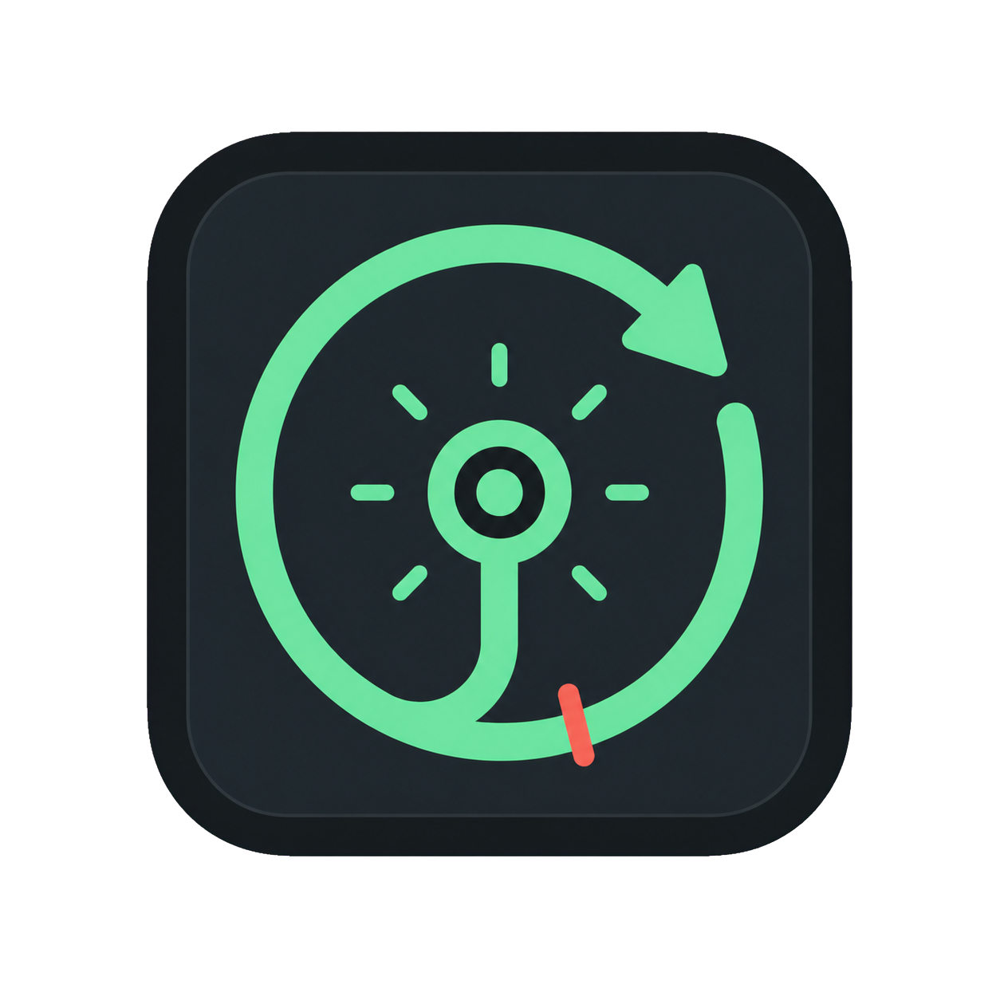
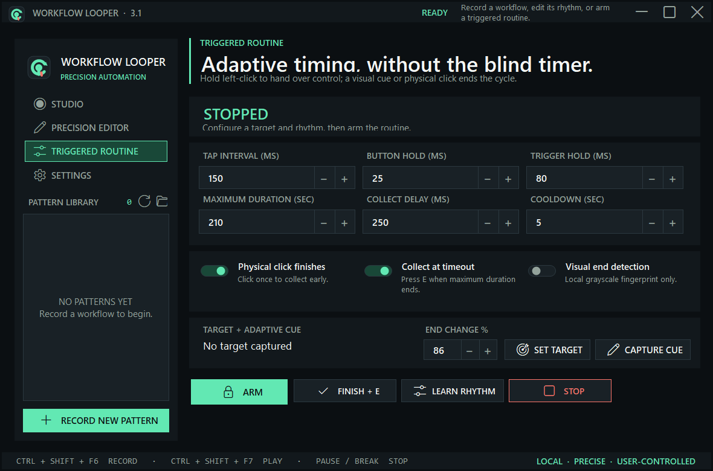
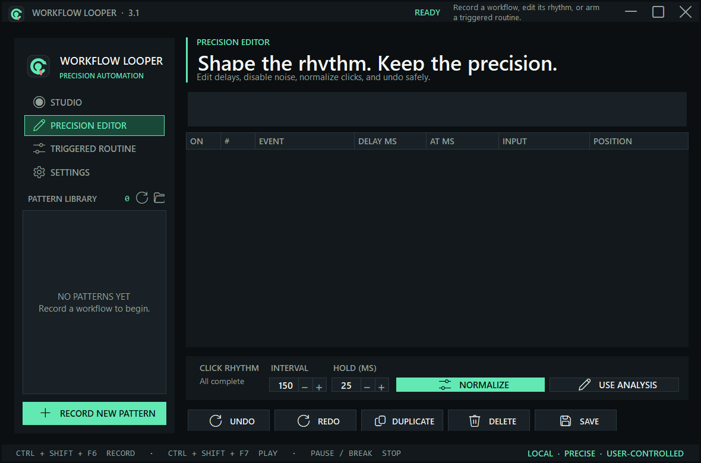

<p align="center">
  
</p>

<h1 align="center">Workflow Looper</h1>

<p align="center">Local-first recording, precision playback, and adaptive triggered routines for Windows.</p>

<p align="center">
  <a href="https://github.com/Blazzer10200/WorkflowLooper/actions/workflows/build.yml"></a>
  <a href="https://github.com/Blazzer10200/WorkflowLooper/releases/latest"></a>
  <a href="LICENSE"></a>
</p>

Workflow Looper records physical keyboard and mouse input, replays it with high-resolution timing, and keeps every pattern on your PC.


## What changed in 3.1

- Custom application icon and matching in-app identity.
- Complete minimize, maximize, restore, resize, and title-bar interaction support.
- Resizable, Per-Monitor-V2 interface with a unified Fluent-style icon system.
- Built-in presets removed. Recordings and calibrated profiles replace canned rhythms.
- Precision Editor for event delays, enable/disable, duplication, deletion, undo/redo, and click normalization.
- Version 2 pattern format with automatic v1 migration, atomic writes, and `.bak` protection.
- Per-pattern loop count, playback speed, cursor behavior, and target-window lock.
- Triggered Routine for variable-start minigames and other handoff workflows.
- Physical-click rhythm calibration.
- Optional local visual-end detection using a 20×12 grayscale fingerprint—not a screenshot.
- Formal automated tests plus the executable self-test.

## Triggered Routine

The routine is designed for workflows whose active phase can appear early or late:

1. Select **Capture Target**. Workflow Looper minimizes and captures the foreground application.
2. Optionally select **Learn My Rhythm** and click naturally for 12 seconds.
3. Set tap interval, button hold, maximum duration, collect delay, and cooldown.
4. Optional: select **Capture Cue**, return to the target, place the cursor over the visible minigame, then press `Ctrl + Shift + F8`.
5. Select **Arm Routine**.
6. When the minigame appears, hold and release physical left-click. Precision tapping begins immediately.
7. Tapping stops when the visual cue changes, you click physically again, or the safety duration expires.
8. The routine releases the mouse, presses `E`, waits for the cooldown, and re-arms.

The supplied fishing recording showed the circular `Increase Tension / LMB` control as the active cue and a green check with `FISHING.CAUGHT` as the completion cue. The default 86% change threshold was selected from those frames, but it remains editable for different displays and minigames.



## Precision Editor

The editor keeps raw input transparent while making timing practical:

- Edit delay before every event.
- Disable noisy events without deleting them.
- Duplicate or delete a selected event.
- Undo and redo up to 50 editing operations.
- Analyze median interval, hold duration, and timing range.
- Normalize all complete left-click pairs to an exact interval and hold.



## Safety

- `Pause / Break` is the default emergency stop.
- Playback releases held buttons and keys during cancellation or failure.
- A target lock stops automation when focus leaves the selected process.
- Simulated input is rejected across some Windows privilege boundaries. Run Workflow Looper and the target at the same integrity level.
- Some games or protected applications block simulated input. Workflow Looper does not include anti-cheat bypass, stealth, or detection-evasion behavior.
- Visual cue capture is opt-in and stores only 240 grayscale samples in local settings.

## Storage

```text
%LOCALAPPDATA%\WorkflowLooper\Patterns\
%LOCALAPPDATA%\WorkflowLooper\settings.json
```

Patterns use readable `.workflow.json` files. Saving an existing pattern writes atomically and preserves the prior copy beside it as `.bak`.

## Download

Download the portable Windows x64 ZIP or executable from [GitHub Releases](https://github.com/Blazzer10200/WorkflowLooper/releases). Compare the download against the published SHA-256 checksum before running it.

Requirements:

- Windows 10 version 1803 or newer; Windows 11 recommended.
- x64 processor.
- No separate .NET installation for the self-contained release.

## Build and verify

```powershell
dotnet build .\WorkflowLooper.sln -c Release
dotnet test .\tests\WorkflowLooper.Tests\WorkflowLooper.Tests.csproj -c Release
& ".\bin\Release\net8.0-windows\win-x64\Workflow Looper.exe" --self-test
dotnet publish .\WorkflowLooper.csproj -c Release -o publish
```

## Project structure

- `src/Application` — startup, settings, and the main window.
- `src/Automation` — recording, playback, timing, input, and adaptive routines.
- `src/Domain` — workflow and routine data models.
- `src/Platform` — Windows integration, target matching, and visual cues.
- `src/Presentation` — theme, controls, icons, and interaction surfaces.
- `src/Diagnostics` — deterministic executable self-tests.
- `tests/WorkflowLooper.Tests` — xUnit timing and persistence coverage.
- `assets/branding` — source artwork, transparent PNG, and multi-size Windows icon.
- `docs` — current UI screenshots.

## License

[MIT](LICENSE)
